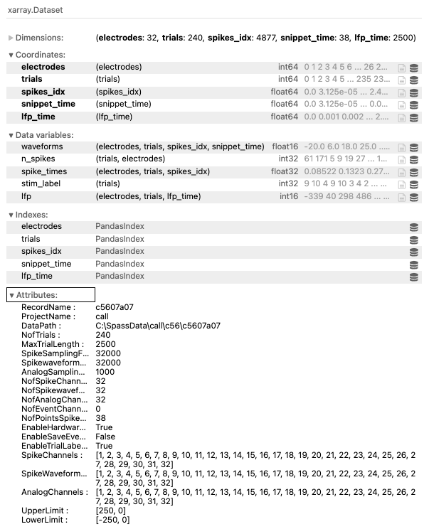

# VisionICeIO

IO Operations to read the data of the Vision Lab in Natal.

## Python Functions and Experiment Classes to read the LabView data

1. In gerenal this is a Python implementation of the Spike2Fieldtrip Implementation reading the LabView data in Matlab.
2. Experiment class to build a wrapper around all data parts (spike times, spike waveforms, analog data, etc.)
3. The current implementation reads the metadata from the metadata *text file* (not binary file) (`...-ifo.txt`).
4. Currently, the following binary files are read:
   
   - `.ana` files: analog LFP data
   - `.spi` files: spike times (not sorted)
   - `.swa` files: spike waveforms (not sorted)
   - `.stm` files: stimulus labels (for each trial); the encoding for the label need to be extracted from the lab notebooks

### TODOs

- [ ] Read `.swave` data
- [ ] Create `.ssort` export
- [ ] Rethink if we want to have the code as installable package or not

## Remarks

*In lack of proper documentation written here.*

The code is currently splitted into two parts:

1. `core_io.py`: the core IO functions to read the binary data and the metadata text file
2. `experiment.py`: the experiment class to wrap the data and provide a convenient interface to access the data

An experiment currently consists of multiple trials, for each trial the analog data, spike times, spike waveforms and stimulus labels are stored.

The current implementation of the Experiment class organises the data in an xarray Dataset, with common dimensions for the trials, channels, snippet time (for spike waveforms) and lfp_time (for analog data).
Snippet time and analog time are different, as the spike trace and the LFP trace have different sampling rates.

Unfortunately, at the current state, the xarray Dataset does not allow inhomogeneous axes, so the spike times and waveforms need to be padded to the maximum occuring number of spikes in per trial per channel.
This is not very memory efficient, but I currently failed to implement a better solution, e.g. using akward arrays etc.
